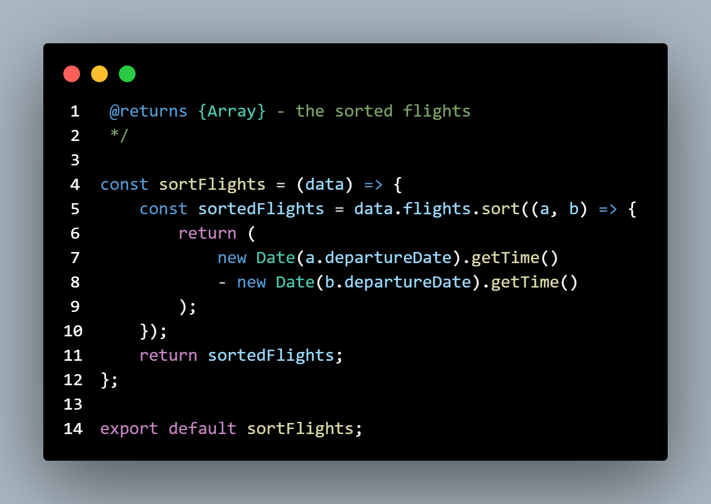

# Image gallery

> A simple

## Table of contents

- [Image gallery](#image-gallery)
  - [Table of contents](#table-of-contents)
  - [General info](#general-info)
  - [Screenshots](#screenshots)
  - [Technologies](#technologies)
  - [Setup](#setup)
  - [Code Examples](#code-examples)
  - [Features](#features)
  - [Status](#status)

## General info

> The objective of the project is to practice separation of concern in
> JavaScript.

## Screenshots



## Technologies

- JavaScript
- HTML5
- CSS3
- VSC code

## Setup

clone the repo and start using the stop watch.

## Code Examples

```js

```

## Features

List of features ready and Todo's for future development

-
-
-

To-do list:

-
-

## Status

Project is: _in progress_
